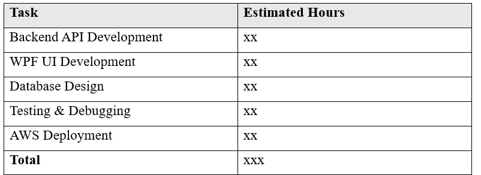
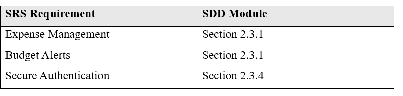
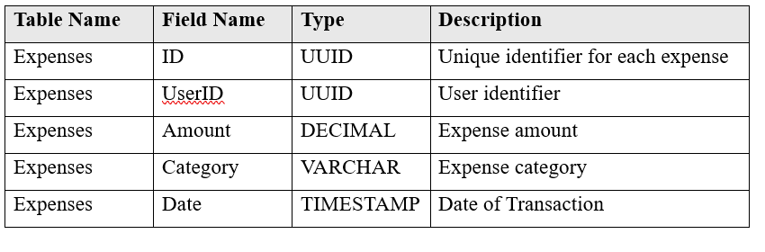

# AWS-Expense-Tracker  

## Section 1: Project Description

### 1.1 Project

Expense Tracker on AWS

### 1.2 Description

The Expense Tracker project is designed to help users seamlessly manage their expenses, set budgets, and visualize financial trends. By leveraging AWS services, the application ensures scalability, security, and high availability. Users can add transactions, categorize expenses, set budgets, and receive alerts when exceeding their budget limits.

### 1.3 Revision History

## Section 2: Overview

### 2.1 Purpose

The purpose of this module is to provide an intuitive and user-friendly interface for tracking expenses, analyzing financial trends, and managing budgets. This module is intended for individual users seeking a personal finance management tool.

### 2.2 Scope

#### Included Features:

- Secure user authentication using AWS Cognito

- Expense management: Add, update, delete, and categorize expenses

- Budget tracking: Set monthly limits and track expenses

- Data visualization: LiveCharts for financial trends

- Cloud storage: AWS DynamoDB for storing data

- Cloud monitoring: AWS CloudWatch for performance tracking

#### Excluded Features:

- Multi-currency support

- AI-based financial recommendations

- Third-party authentication (Google/Facebook login)

- Multi-user collaboration

### 2.3 Requirements

#### 2.3.1 Functional Requirements

- Users can securely log in to their accounts.

- Users can input and categorize expenses.

- The system shall notify users when budget limits are exceeded.

- Expenses are displayed using LiveCharts for visualization.

#### 2.3.2 Non-Functional Requirements

- The system shall be highly scalable using AWS services.

- The application shall have 99.9% uptime.

- Secure data encryption for all stored and transmitted data.

#### 2.3.3 Technical Requirements

- Backend hosted on AWS EC2

- Data stored in AWS DynamoDB

- UI developed with WPF using .NET Core

- API security managed via AWS API Gateway

#### 2.3.4 Security Requirements

- AWS Cognito for authentication

- AWS API Gateway for secure API access

- IAM roles for minimal privilege access

#### 2.3.5 Estimates

#### 2.3.6 Traceability Matrix

## Section 3: System Architecture

### 3.1 Overview

The Expense Tracker system is built using AWS cloud services to ensure scalability and security. The architecture consists of the following components:

- Frontend: WPF application built with .NET Core.

- Backend: REST API hosted on AWS EC2.

- Database: AWS DynamoDB for storing user expenses and budgets.

- Authentication: AWS Cognito for secure user management.

- Monitoring: AWS CloudWatch for tracking system performance.

### 3.2 Architectural Diagram

(To be added as a visual representation of system components and interactions.)

## Section 4: Data Dictionary

## Section 5: Data Design

### 5.1 Persistent/Static Data

The Expense Tracker uses AWS DynamoDB to store expenses, user details, and budget information.

### 5.1.1 Entity Relationship Diagram (ERD)

(To be added: A diagram illustrating relationships between User, Expenses, and Budget.)

## Section 6: User Interface Design

### 6.1 UI Overview

The UI is developed using WPF and provides the following functionalities:

- Expense entry form

- Budget setting panel

- Expense list with editing options

- Expense trend chart using LiveCharts

### 6.2 UI Navigation Flow

(To be added: Diagram showing navigation between different UI screens.)

### 6.3 Use Cases

- Adding an Expense: User enters details, selects category, and submits.

- Setting a Budget: User inputs a monthly limit and saves it.

- Viewing Trends: Expenses are displayed in a chart for analysis.

## Next Steps

- Implement detailed testing plan

- Create deployment scripts for AWS

- Integrate AWS CloudWatch monitoring

